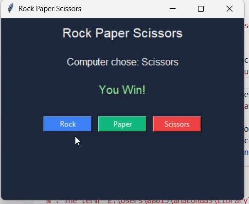

# Rock Paper Scissors GUI

A simple **Rock–Paper–Scissors desktop game** built using **Python Tkinter**.

This project demonstrates basic **GUI programming, event handling, and game logic** in Python.

---

## Features

* Graphical user interface using Tkinter
* Rock, Paper, Scissors buttons
* Computer opponent with random choices
* Result display (Win / Lose / Draw)
* Colored UI design
* Beginner-friendly project structure

---


## Demo




---

## Project Structure

```
rock-paper-scissors-gui/
│
├── rps_gui.py
├── README.md
└── LICENSE
```

---

## How to Run

Make sure Python is installed.

Run the game:

```
python rps_gui.py
```

A game window will open.

---

## Example Gameplay

1. Click Rock, Paper, or Scissors
2. The computer makes a choice
3. The result is displayed

---

## Technologies Used

* Python
* Tkinter
* Random module

---

## Learning Goals

This project helps practice:

* GUI programming with Tkinter
* Button events
* Layout management
* Game logic in Python
* Working with random choices

---

## Author

TusteeMazumdar
[https://github.com/TusteeMazumdar](https://github.com/TusteeMazumdar)

---

## License

MIT License

